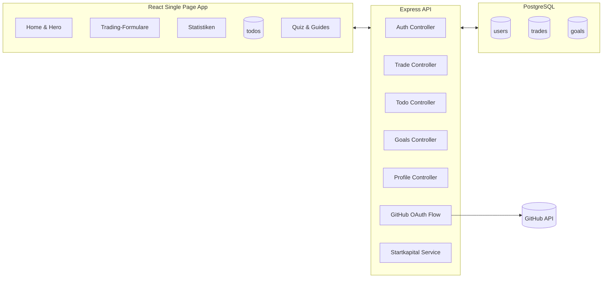

# Trading Journal Dashboard

Ein Full-Stack-Projekt fuer Trader:innen, die ihre Performance dokumentieren, auswerten und aktiv verbessern moechten. Die Anwendung kombiniert ein modernes React-Frontend mit einem Express/PostgreSQL-Backend, GitHub-OAuth, interaktiven Statistiken und praxisnahen Lerninhalten.

## Inhaltsverzeichnis
- [Demo & Screenshots](#demo--screenshots)
- [Highlights](#highlights)
- [Architekturueberblick](#architekturueberblick)
- [Technologie-Stack](#technologie-stack)
- [Projektstruktur](#projektstruktur)
- [Lokales Setup](#lokales-setup)
- [Umgebungsvariablen](#umgebungsvariablen)
- [Datenbank & Migrationen](#datenbank--migrationen)
- [Tests & Qualitaetssicherung](#tests--qualitaetssicherung)
- [Deployment-Ideen](#deployment-ideen)
- [Fuehrungen durch die App](#fuehrungen-durch-die-app)
- [API-Ueberblick](#api-ueberblick)
- [Roadmap & Beitragen](#roadmap--beitragen)
- [Monitoring](#monitoring)

## Demo & Screenshots
- **Live-Demo**: _noch nicht deployt_
- **Screencast**: _Optional hier verlinken._
- **Screenshot-Galerie**: Legen Sie Ihre Screenshots in `docs/screenshots` ab. Beispiel-Referenzen:
  - 
  - 
  - 
  - 

> Tipp: Nutzen Sie Tools wie `npx playwright test --ui` oder das Windows Snipping Tool, um konsistente Screenshots in Desktop- und Mobile-Breakpoints aufzunehmen. Benennen Sie die Dateien nach dem Muster `seite-variante.png`, damit GitHub die Galerie sauber rendert.

## Highlights
- **Trading-Cockpit**: Erfassung von Trades inkl. P/L, Pip-Daten, Spread-Kontrolle und Export als PDF.
- **Ziele & Todos**: Priorisierte Ziele, ToDos und Reflexionen gewaehrleisten ein strukturiertes Performance-Coaching.
- **Analytics & Stats**: Recharts-basierte Visualisierungen mit Dark-Mode, Laufzeiten und Kennzahlen.
- **Lernmodul & Quiz**: Interaktive Guides, Quizfragen und modulare Lerninhalte fuer skalierbares Wissen.
- **GitHub OAuth & klassische Authentifizierung**: Login per GitHub oder Passwort mit JWT-Token.
- **Dark-/Light-Mode**: Animierte Lampe, persistente Praeferenzen, dynamische Helligkeitsregler.
- **Export & Dokumentation**: PDF-Export, automatischer Spread-Check sowie Startkapital-Verwaltung.
- **Observability**: Prometheus-Metriken und Loki-Logs stehen ueber Helm-Chart bereit.

## Architekturueberblick


## Technologie-Stack
- **Frontend**: React 19, Vite, TailwindCSS 4, Framer Motion, React Router 7, Recharts, lucide-react Icons.
- **Backend**: Node 22+, Express 5, PostgreSQL, JWT, bcrypt, Winston-Logging.
- **Auth**: Klassischer Login + GitHub OAuth.
- **Testing**: Vitest (Frontend & Backend), Testing Library, Playwright fuer E2E.
- **DevOps**: Dockerfiles fuer Frontend & Backend, Terraform-Snippets in `infra`, Helm Charts fuer Kubernetes-Deployments.

## Projektstruktur
```text
my-fullstack-app/
├─ backend/            # Express-Server, Routen, Controller, SQL-Migrationen
├─ frontend/           # React SPA
├─ docs/
│  └─ screenshots/     # Platz fuer Praesentationsbilder (per .gitkeep angelegt)
├─ helm/               # Kubernetes Charts (nginx, postgres, monitoring)
└─ infra/              # Terraform-Infrastruktur (Backend, Netzwerk, Outputs)
```

## Lokales Setup
1. **Repository klonen**
   ```bash
   git clone https://github.com/<USER>/trading-dashbord.git
   cd trading-dashbord/my-fullstack-app
   ```
2. **Backend installieren & starten**
   ```bash
   cd backend
   npm install
   cp .env.example .env   # falls bereitgestellt, sonst siehe Variablen unten
   npm run dev            # optional via nodemon, ansonsten node server.js
   ```
3. **Frontend installieren & starten**
   ```bash
   cd ../frontend
   npm install
   cp .env.example .env   # VITE_API_URL konfigurieren
   npm run dev            # startet Vite auf http://localhost:5173
   ```
4. **Mit Docker (optional)**
  - `docker build -t trading-backend ./backend`
  - `docker build -t trading-frontend ./frontend`
  - Eine `docker-compose.yml` kann schnell ergaenzt werden, falls Deployment mit gemeinsamen Netzen gewuenscht ist.

## Umgebungsvariablen
| Bereich   | Variable                 | Beschreibung                                         |
|-----------|--------------------------|------------------------------------------------------|
| Backend   | `PORT`                   | Port des Express-Servers (Standard: 3000)            |
| Backend   | `DATABASE_URL`           | PostgreSQL-Connection-String                         |
| Backend   | `JWT_SECRET`             | Geheimnis zur Signierung von JWTs                    |
| Backend   | `GITHUB_CLIENT_ID`       | OAuth Client ID fuer GitHub                          |
| Backend   | `GITHUB_CLIENT_SECRET`   | OAuth Client Secret                                  |
| Backend   | `FRONTEND_URL`           | Basis-URL der SPA fuer OAuth Redirects               |
| Frontend  | `VITE_API_URL`           | Basis-URL fuer API-Aufrufe (z. B. `http://localhost:3000/api`) |

> Empfehlung: Fuer lokale Entwicklung eignet sich eine `.env` im Backend sowie `.env.local` im Frontend. Die Variablen werden durch `dotenv` bzw. Vite automatisch geladen.

## Datenbank & Migrationen
- SQL-Migrationen liegen in `backend/models` (nummeriert).
- `init.sql` erzeugt Basistabellen (u. a. `users`, `trades`, `todos`, `goals`).
- Zusaetzliche Migrationen erweitern die Struktur (Priority-Felder, PnL, Pip-Mode, usw.).
- Migrationen lassen sich beispielsweise mit `psql` oder `node-pg-migrate` anwenden. Eine einfache Reihenfolge:
  ```bash
  psql "$DATABASE_URL" -f backend/models/init.sql
  for file in backend/models/00*-*.sql; do
    psql "$DATABASE_URL" -f "$file"
  done
  ```

## Tests & Qualitaetssicherung
- `npm run lint` (Front- & Backend) fuer ESLint + Prettier-Checks.
- `npm run test` fuehrt Vitest mit Coverage aus.
- `npm run test:e2e` bzw. `npm run test:e2e:ui` im Frontend starten Playwright.
- Husky & lint-staged (optional aktivieren) verhindern fehlerhafte Commits.

## Deployment-Ideen
1. **Static Frontend + API**: Frontend auf Vercel/Netlify deployen, Backend on Render/Render Postgres oder Railway.
2. **AWS Amplify**: Hosting + CI/CD; Kostenfrei im Free Tier, danach nutzungsbasiert.
3. **Docker/Kubernetes**: Helm Charts (`helm/`) ermoeglichen Rollouts auf AKS, GKE oder lokalem k3s.
4. **Terraform**: `infra/` liefert ein Grundgeruest zur Provisionierung von Infrastruktur-Ressourcen.

## Monitoring
- Backend exportiert Prometheus-Metriken unter `/metrics` und tracked jede Anfrage per Histogramm.
- Helm-Chart in [helm/monitoring](helm/monitoring/README.md) installiert kube-prometheus-stack, Grafana sowie Loki.
- Schnellstart:
  ```bash
  cd helm/monitoring
  helm repo add prometheus-community https://prometheus-community.github.io/helm-charts
  helm repo add grafana https://grafana.github.io/helm-charts
  helm dependency update
  helm upgrade --install monitoring . --namespace monitoring --create-namespace
  kubectl -n monitoring port-forward svc/monitoring-grafana 3000:80
  ```
- Stelle sicher, dass der Backend-Service in Kubernetes das Label `app.kubernetes.io/name=backend` besitzt und einen Port `http` bereitstellt. Dann greift der ServiceMonitor automatisch zu.
- Grafana Login (Standard): `admin / changeMe123!` → direkt aendern; Dashboard `Backend Overview` wird automatisch geladen.
- Prometheus UI via `kubectl -n monitoring port-forward svc/monitoring-kps-prometheus 9090:9090` erreichbar, Alertmanager via `kubectl -n monitoring port-forward svc/monitoring-kps-alertmanager 9093:9093`.
- Passe `helm/monitoring/values.yaml` an (z. B. Alert-Empfaenger, Persistenz, Ingress) bevor du produktive Cluster nutzt.

## Fuehrungen durch die App
_Bitte fuegen Sie reale Screenshots in `docs/screenshots` ein und passen Sie die Dateinamen an._

| Seite / Feature           | Beschreibung | Screenshot |
|---------------------------|--------------|------------|
| Home & Onboarding         | Hero-Sektion, Call-to-Action, GitHub Login |  |
| Trading-Journal           | Trade-Erfassung, Filter, PDF-Export |  |
| Statistiken               | KPI-Kacheln, Recharts, Dark Mode |  |
| Todos & Ziele             | Priorisierte Todo-Liste mit Inline-Edit |  |
| Profil & Einstellungen    | Passwortwechsel, Startkapital, Logout |  |
| Lernmodule & Quiz         | Strategien, interaktive Fragen |  |
| Rechtliches (Impressum etc.) | DSGVO-konforme Pflichtseiten |  |

## API-Ueberblick
| Methode | Endpoint                   | Zweck |
|---------|----------------------------|-------|
| POST    | `/api/auth/register`       | Registriert Nutzer mit Passwort |
| POST    | `/api/auth/login`          | Login per Benutzername oder E-Mail |
| GET     | `/api/auth/github`         | Startet GitHub OAuth Flow |
| GET     | `/api/auth/github/callback`| GitHub Redirect, erstellt JWT |
| GET/POST/PUT/DELETE | `/api/todos`   | Priorisierte Todos verwalten |
| GET/POST             | `/api/trades` | Trades inkl. P/L & Pip-Modi |
| GET/PUT              | `/api/profile`| Profil, Startkapital, Passwortwechsel |
| GET                  | `/api/goals`  | Zielsetzungen abrufen |
| GET/POST             | `/api/startkapital` | Historie & Anpassungen |

> Detail-Implementierungen finden Sie in `backend/controllers` und `backend/routes`.

## Roadmap & Beitragen
- [ ] Seed-Skripte fuer Demo-Daten bereitstellen
- [ ] Automatisierte Migrationen (z. B. via `node-pg-migrate`)
- [ ] Internationale Uebersetzungen (en/de Toggle)
- [ ] CI/CD-Pipeline (GitHub Actions) fuer Tests + Lint
- [ ] Weitere KPIs (z. B. Sharpe Ratio, Drawdown)

Beitraege sind willkommen! Bitte oeffnen Sie erst ein Issue oder verfassen Sie einen kurzen Vorschlag, bevor neue Features umgesetzt werden, damit das Gesamtbild konsistent bleibt.
